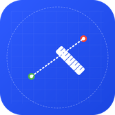

# ARMeter - Augmented Reality Measurement App



ARMeter is an augmented reality application that allows you to measure distances in the real world using ARKit on iOS devices. With its user-friendly interface and various measurement units, you can make quick and accurate measurements.

## Table of Contents

- [Features](#features)
- [System Requirements](#system-requirements)
- [Installation](#installation)
- [Usage](#usage)
- [Project Structure](#project-structure)
- [Architecture](#architecture)
- [Coding Approach](#coding-approach)
- [Performance Optimizations](#performance-optimizations)
- [Development Process](#development-process)
- [Future Features](#future-features)
- [License](#license)

## Features

- **Precise Measurement**: Surface detection with ARKit and accurate distance measurement in the real world
- **Multiple Measurement Units**: Measurements in meters, centimeters, inches, and feet
- **Measurement Recording**: Ability to save measurements and add notes
- **Visual Feedback**: Start and end points, measurement lines, and distance labels
- **Haptic Feedback**: Better user experience with tactile feedback
- **Onboarding Guide**: Introductory screen that guides users when the app is first opened
- **Settings**: Customizable settings (haptic feedback, guide points)
- **Metal Optimization**: Enhanced performance with Metal API
- **AR Surface Detection**: Automatic detection of horizontal and vertical surfaces

## System Requirements

- iOS 16.0 or later
- An iOS device that supports ARKit (iPhone/iPad)
- Camera access
- No internet connection required (works completely offline)

## Installation

1. Clone or download the project:
   ```bash
   git clone https://github.com/yourusername/ARMeter.git
   ```

2. Open the project in Xcode:
   ```bash
   cd ARMeter
   open ARMeter.xcodeproj
   ```

3. Build and run the app on a device or simulator:
   - Select an appropriate target device in Xcode
   - Click the Run button or press `Cmd+R`

> Note: For ARKit functionality, it is recommended to test on a real iOS device. AR features do not work fully in the simulator.

## Usage

### First Use

1. When you open the app for the first time, you will encounter the onboarding guide.
2. Approve camera permissions.
3. Follow the guidance steps to learn the basic functions of the app.
4. Click the "Start" button to go to the main measurement screen.

### Making Measurements

1. Point your device toward a horizontal or vertical surface.
2. Wait for surfaces to be detected (you will see a status message at the top of the screen).
3. Click the large measurement button in the center.
4. Touch the screen to select the start point (a green dot will appear).
5. Touch another location to select the end point (a red dot will appear).
6. The distance between the two points will be automatically calculated and displayed.
7. Click the "Save" button to save the measurement.
8. Optionally add a note.

### Changing Measurement Units

1. Click the ruler icon at the bottom of the screen.
2. Select your desired measurement unit from the menu (m, cm, in, ft).
3. All current and future measurements will be displayed in the selected unit.

### Measurement History

1. Click the clock icon at the bottom of the screen.
2. View all saved measurements and notes.
3. Click the "Edit" button to delete measurements.

### Settings

1. Click the gear icon on the right side of the screen.
2. Turn haptic feedback on/off.
3. Turn guide points on/off.
4. Get information about the app.

## Project Structure

The ARMeter project is structured modularly following the MVVM architectural pattern:

```
ARMeter/
├── ARMeterApp.swift          # Application entry point
├── ContentView.swift         # Main content view
├── Info.plist                # Application configuration information
├── Models/                   # Data models
│   └── MeasurementModel.swift # Measurement data model
├── ViewModels/               # View models
│   ├── AppViewModel.swift    # Application state and operations
│   └── ARViewModel.swift     # AR operations and state
├── Views/                    # User interface views
│   ├── MainView.swift        # Main view
│   ├── MeasurementView.swift # Measurement screen
│   └── OnboardingView.swift  # Onboarding screen
├── Utils/                    # Helper classes
│   ├── HapticManager.swift   # Haptic feedback manager
│   └── MaterialConfigurator.swift # AR material configurator
└── Resources/                # Resources
    └── Shaders/              # Metal shaders
        └── ShaderConfig.metal # Metal configuration
```

## Architecture

ARMeter is developed using the MVVM (Model-View-ViewModel) architectural pattern:

### Model Layer

- **MeasurementModel.swift**: Model defining measurement results, units, and other related data.
- Persistent storage of user measurements and application state.

### View Layer

- **MainView.swift**: Top-level view managing the main structure and navigation flow of the application.
- **MeasurementView.swift**: Contains AR measurement interface, measurement control panels, and user interactions.
- **OnboardingView.swift**: Guidance screen for first-time app users.
- Modular sub-views created with SwiftUI (`UnitPickerView`, `SettingsView`, etc.).

### ViewModel Layer

- **AppViewModel.swift**: Manages application state, measurement operations, user settings, and application flow.
- **ARViewModel.swift**: Manages ARKit interactions, camera operations, surface detection, and AR scene.

### Helper Components

- **HapticManager**: Haptic feedback operations.
- **MaterialConfigurator**: Material configuration for AR objects.

## Coding Approach

Coding approaches adopted in the ARMeter project:

### Reactive Programming

- Reactive data flow with **@Published** properties and Combine framework.
- Interface updates based on state changes.

### Protocol-Oriented Programming

- Code reuse and modularity through protocols and extensions.
- Definition of functionality through specific interfaces.

### Performance Optimization

- High-performance graphics processing with Metal API.
- Thread management to prevent UI blocking.
- Efficient use of ARKit resources.

### Memory Management

- Prevention of weak references and memory leaks.
- Optimization of temporary memory usage with autoreleasepool.

## Performance Optimizations

ARMeter utilizes various techniques for an optimized user experience:

### AR Optimizations

- **Selective Feature Usage**: Only necessary ARKit features are enabled.
- **Gradual AR Startup**: AR session starts with minimal configuration and is gradually enhanced.
- **AR Frame Management**: Memory usage is optimized by preventing unnecessary retention of frames.

### Graphics Optimizations

- **Simple Geometries**: Optimized geometries for measurement points and lines.
- **Metal Integration**: Graphics processing with direct Metal API calls.
- **Simple Materials**: Simple, low-cost materials are preferred over complex ones.

### UI Optimizations

- **Asynchronous Operations**: Calculations and operations performed in the background.
- **Thread Management**: Operations are executed on appropriate threads to prevent UI blocking.
- **Touch Event Optimization**: The way touch events are processed is optimized.

## Development Process

When developing with this project:

1. **Build the project**: Use Xcode to build and run
2. **Test on device**: ARKit features require a physical iOS device
3. **Follow MVVM**: Maintain the established architectural patterns
4. **Optimize for AR**: Be mindful of ARKit performance considerations

## Future Features

Planned future features for ARMeter:

- **Multiple Measurement Points**: Area and volume measurement with multiple points.
- **LiDAR Integration**: Use of LiDAR sensor for more accurate measurements on supported devices.
- **Measurement Sharing**: Sharing measurements as AR experience or images.
- **Area Scanning**: Creating detailed 3D models by scanning an area.
- **Template Measurements**: Pre-defined measurement templates for common objects.
- **Voice Commands**: Ability to perform measurement operations with voice commands.

## License

The ARMeter project is licensed under a Non-Commercial license. This license allows the software to be used, modified, and distributed free of charge for non-commercial purposes, while requiring explicit written permission from the copyright holder for commercial use. See the `LICENSE` file for more information.

---

© 2025 Emre Argana. All rights reserved.